# My Business Web: Nanmeebooks Co., Ltd.
เว็บไซต์จำลองของ บริษัท นานมีบุ๊คส์ จำกัด (Nanmeebooks Co., Ltd.) 

## ข้อมูล Assignment#1
เว็บไซต์นี้ประกอบด้วย 4 หน้าหลัก ได้แก่ หน้าแรก, เกี่ยวกับเรา, บริการ, และติดต่อเรา 

## โครงสร้างไฟล์
- `index.html` : หน้าแรก (Home)
- `about.html` : หน้าเกี่ยวกับเรา (About Us)
- `services.html` : หน้าบริการ (Services)
- `contact.html` : หน้าติดต่อเรา (Contact)
- `css/`
  - `styles.css` : ไฟล์ CSS หลัก (Styling)
- `images/` : โฟลเดอร์เก็บรูปภาพ (logo.png, CEO.jpg, MD.jpg)
- `screenshots/` : โฟลเดอร์เก็บรูปภาพหน้าจอ
- `README.md` : เอกสารประกอบโปรเจกต์

## ลิงก์เข้าสู่หน้าเว็บ
- [หน้าแรก](index.html)
- [เกี่ยวกับเรา](about.html)
- [บริการของเรา](services.html)
- [ติดต่อเรา](contact.html)

## CSS Checklist
ความเรียบร้อย checklist แต่ละข้อ
- [x] Universal Selector & Reset 
- [x] Element Selectors (h1-h4, p, a, etc.) 
- [x] Class Selectors (.hero, .card, .btn, etc.) 
- [x] ID Selectors (#header, #footer) 
- [x] Pseudo-classes (:hover, :active, :first-child) 
- [x] CSS Units (px, rem, %, vw, vh) 
- [x] Color Palette & Typography 
- [x] Box Model (padding, margin, border) 
- [x] Positioning (sticky, absolute, fixed) 
- [x] Display & Layout (flexbox, grid) 
- [x] Hover Effects & Transitions 
- [x] CSS Organization & Comments 

## รูปหน้าจอทั้งหมด (Screenshots)
### 1. หน้าแรก
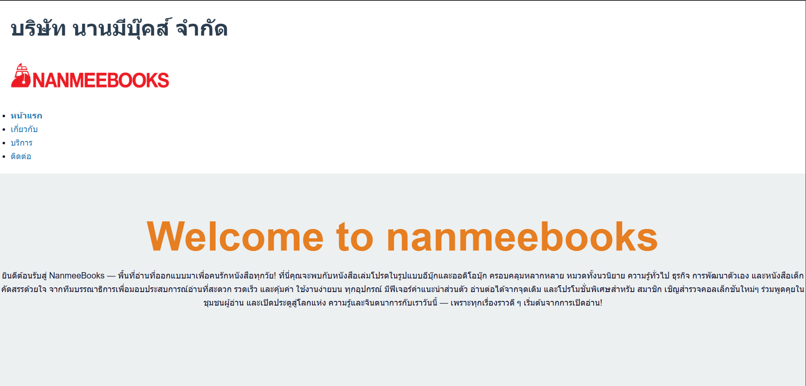
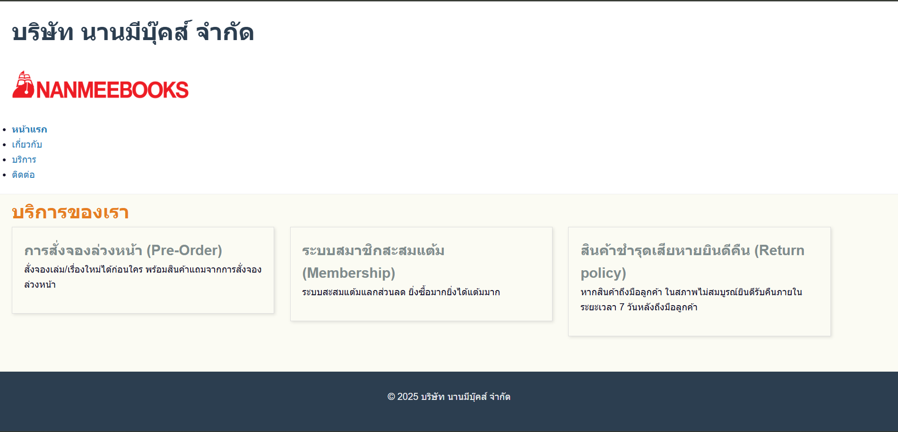
### 2. หน้าเกี่ยวกับเรา
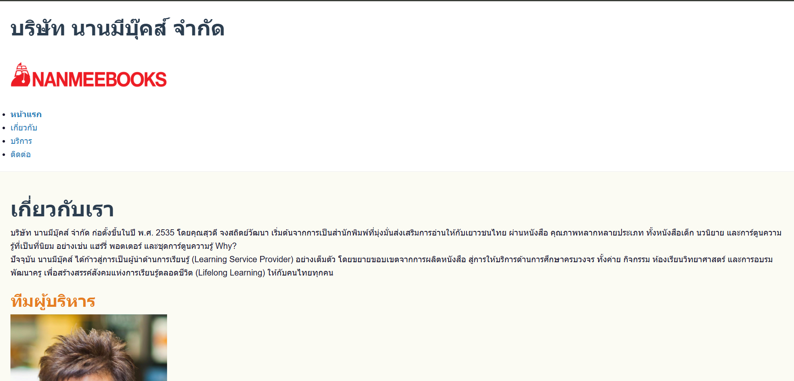

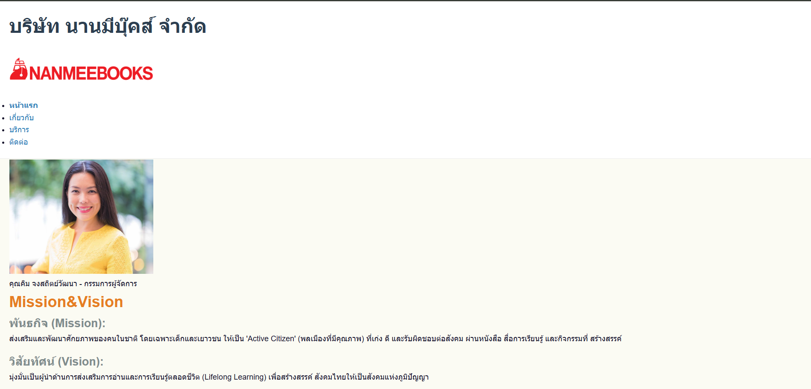
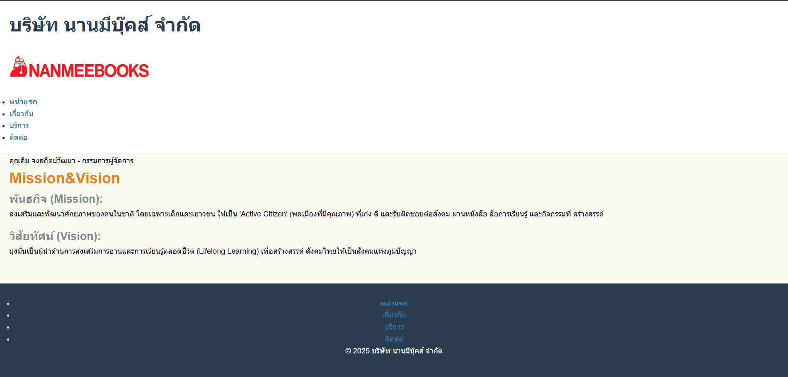
### 3. หน้าบริการ
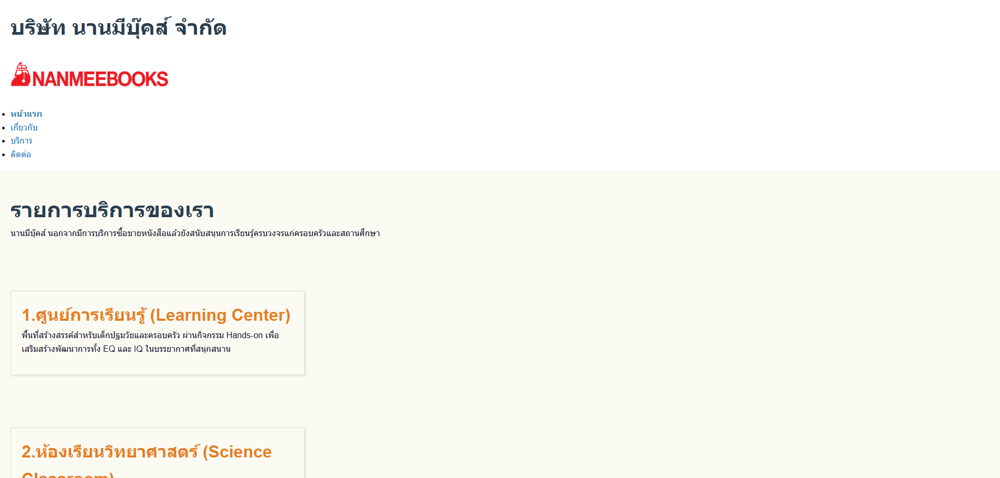
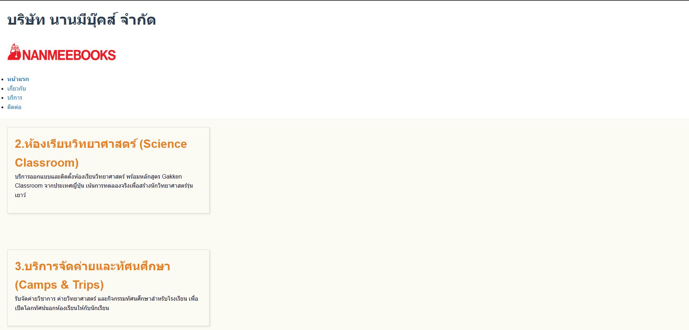
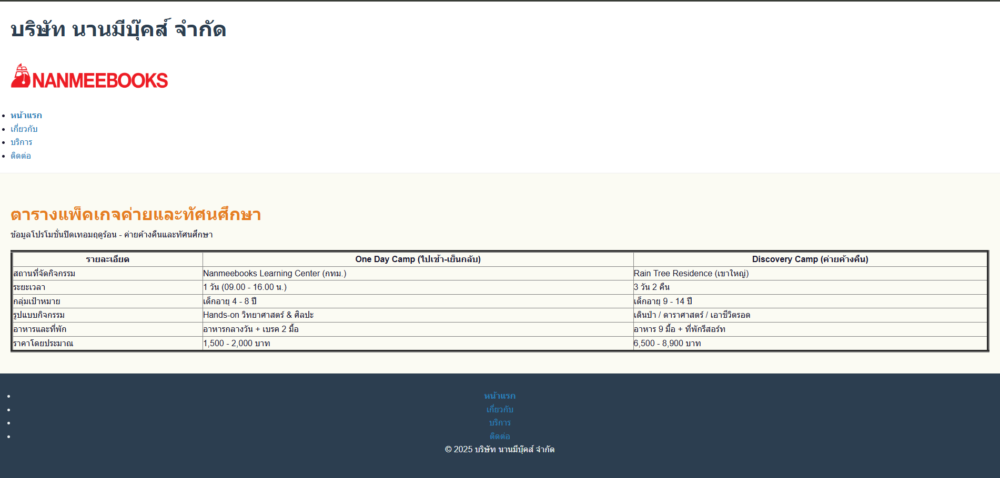
### 4. หน้าติดต่อเรา
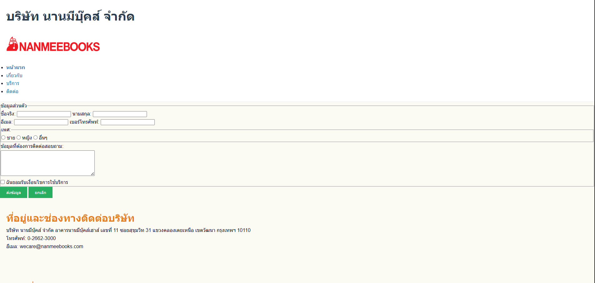
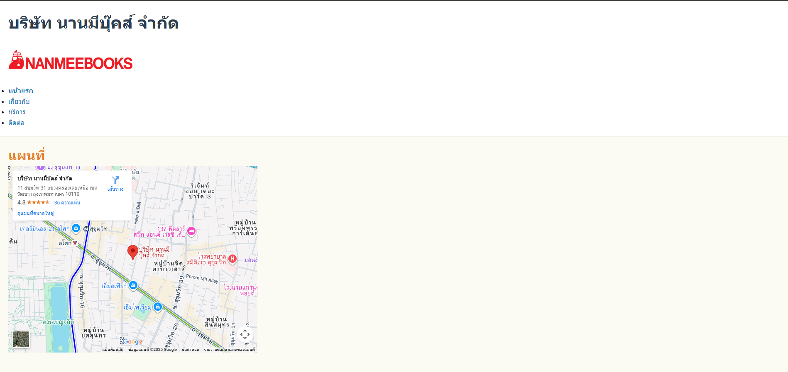
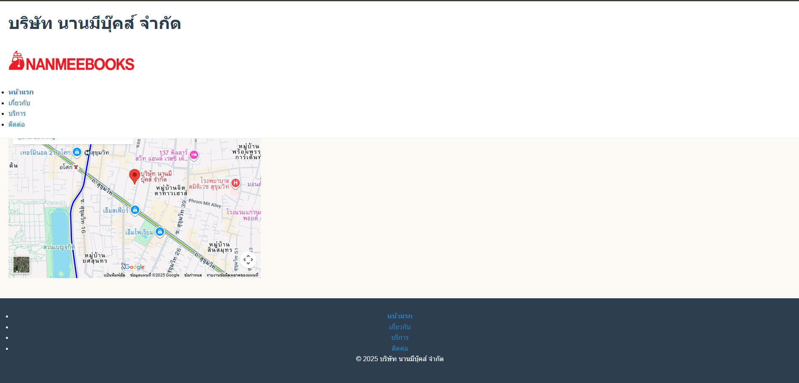

## ผู้จัดทำ
ชื่อ-นามสกุล: นายชิษณุพงศ์ โรจน์เลิศกิจจา
รหัสนักศึกษา: 67160025